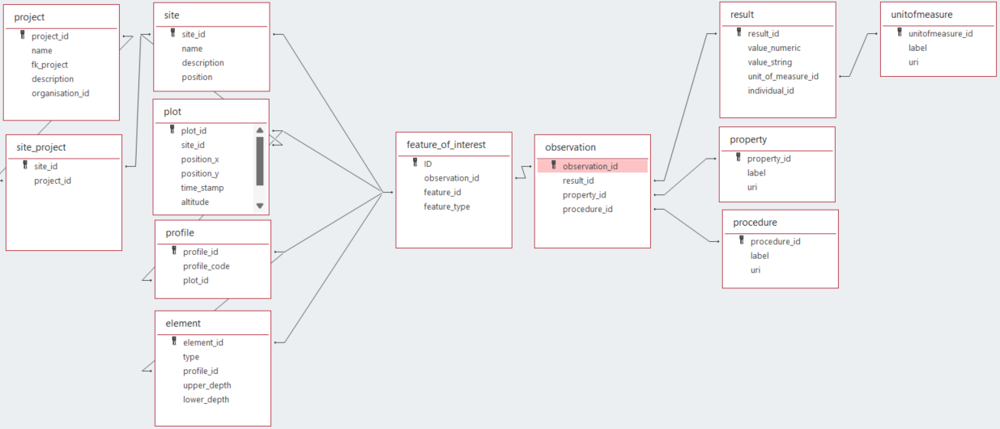

# iso28258 as rdbs

ISO 28258:2013 describes how to digitally exchange soil-related data. It aims to facilitate the exchange of valid, clearly described and specified soil-related data between individuals and organizations via digital systems, and enables any soil data producer, holder or user to find and transfer data in an unambiguous way. [Read more](https://www.iso.org/standard/44595.html)

ISO28258 is implemented as a UML model. The UML model has been used to create a relational database model able to capture the entities from the UML model and their relations in a database. Initial development started in MS Access and is ported to other formats, such as GeoPackage (SQLite) and PostGreSQL. The benefit of the latter is that they can store positions as actual geometries.  

This work builds on the work of Sousa et al, which implemented a [postgres version of ISO28258](https://iso28258.isric.org). A simplification has been applied to the model suggested by Sousa et al, the observation and result types are not split out by type (pysio chemical, biological, ...) but all stored in a single results table.

